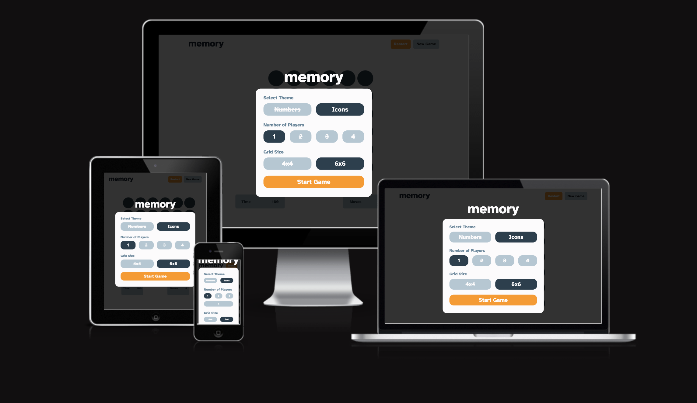
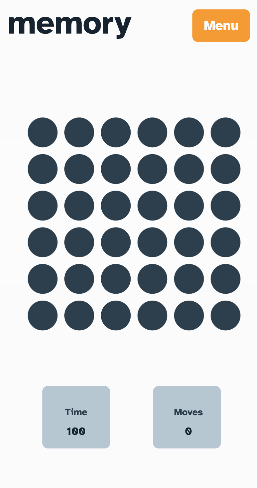
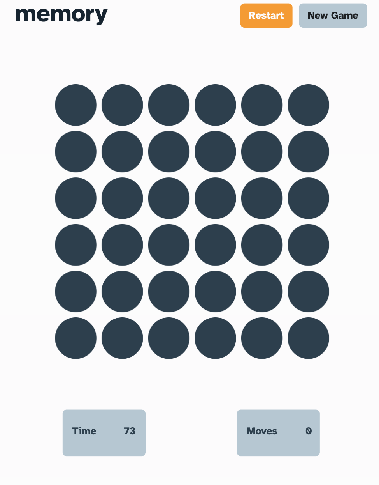

# Frontend Mentor - Memory game solution

This is a solution to the [Memory game challenge on Frontend Mentor](https://www.frontendmentor.io/challenges/memory-game-vse4WFPvM). Frontend Mentor challenges help you improve your coding skills by building realistic projects. 

## Table of contents

- [Overview](#overview)
  - [The challenge](#the-challenge)
  - [Screenshot](#screenshot)
  - [Links](#links)
- [My process](#my-process)
  - [Built with](#built-with)
  - [What I learned](#what-i-learned)
  - [Continued development](#continued-development)
  - [Useful resources](#useful-resources)
- [Author](#author)

## Overview

### The challenge

Users should be able to:

- View the optimal layout for the game depending on their device's screen size
- See hover states for all interactive elements on the page
- Play the Memory game either solo or multiplayer (up to 4 players)
- Set the theme to use numbers or icons within the tiles
- Choose to play on either a 6x6 or 4x4 grid

### Screenshot

### Links

- Solution URL: [solution](https://www.frontendmentor.io/solutions/memory-game-8RBjN8SFVb)
- Live Site URL: [live site](https://j-r77-stack.github.io/memory-game/)

## My process

### Built with

- Semantic HTML5 markup
- CSS custom properties
- Mobile-first workflow
- [Bootstrap5](https://getbootstrap.com/)
- [Google Fonts](https://fonts.google.com/)
- [Git](https://git-scm.com/)
      * Used for version control.
- [GitHub](https://github.com/)
      * Used to store the code once pushed from Git. 

### What I learned

It was good practice for understanding JavaScript more

### Continued development

Continue to practice JavaScript. This project was not completely finished. I still want to add more game options such as 1-4 players, 4 x 4 grids, numbers and results for players to see.

### Useful resources

- [Example resource 1](https://www.youtube.com/watch?v=3uuQ3g92oPQ) - This helped me alot to crate the JavaScript for the game
- [w3schools](https://www.w3schools.com/) - A great webpage for someone beginning their journey with code.
- [stackoverflow](https://stackoverflow.com/) - Another very useful site.

## Author

- Frontend Mentor - [@J-R77-stack](https://www.frontendmentor.io/profile/J-R77-stack)
- Linkedin - [@johnny-ramsay](https://www.linkedin.com/in/johnny-ramsay-developer/)

